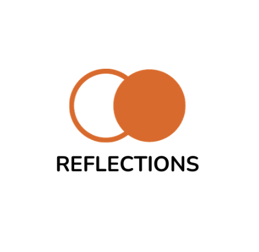

# Reflections-backend

An application that allows expecting/current parents to come together and connect with eachother through a chat/forum. It also has additional resources for parents dealing with stress, postpartum depression, and other related issues that come with having a family. It provides users with therapists in the area to work with for effectively dealing with postpartum or any other mental health issues.

### The developers
[Blanca Altamirano](https://github.com/winterbelle)
 
[Monir Hossen](https://github.com/monir9h)
 
[Phillip Mitchell](https://github.com/p-mitchell1007)